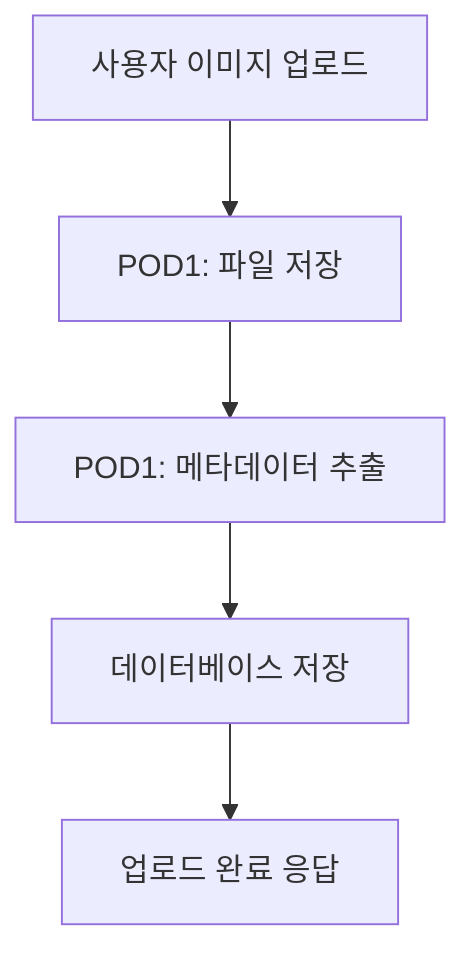
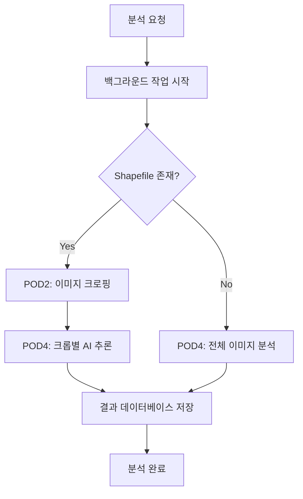

# Nong-View 통합 시스템 아키텍처

**문서 버전**: v2.0  
**작성일**: 2025-10-27  
**아키텍트**: Claude Sonnet  

---

## 📖 개요

### 시스템 목적
Nong-View는 드론 항공사진을 이용한 AI 기반 농업영상분석 플랫폼으로, 통합 Jupyter 노트북 환경에서 개발 및 테스트가 가능한 시스템입니다.

### 아키텍처 원칙
1. **모듈화**: POD 기반 독립적 모듈 설계
2. **확장성**: 새로운 POD 모듈 쉽게 추가 가능
3. **통합성**: 단일 노트북에서 전체 시스템 관리
4. **실시간성**: 즉시 테스트 및 디버깅 지원

---

## 🏗️ 전체 시스템 아키텍처

### 시스템 레이어
```
┌─────────────────────────────────────────────────────────┐
│                    사용자 인터페이스                         │
├─────────────────────────────────────────────────────────┤
│  Jupyter Notebook  │  FastAPI Docs  │  REST API Client  │
├─────────────────────────────────────────────────────────┤
│                       API 레이어                         │
├─────────────────────────────────────────────────────────┤
│   Images API   │   Analysis API   │   Exports API      │
├─────────────────────────────────────────────────────────┤
│                     비즈니스 로직                         │
├─────────────────────────────────────────────────────────┤
│  POD1 (Data)  │  POD2 (Crop)  │  POD4 (AI)  │  POD6  │
├─────────────────────────────────────────────────────────┤
│                    데이터 액세스                          │
├─────────────────────────────────────────────────────────┤
│  SQLAlchemy ORM  │  File System  │  Model Storage     │
├─────────────────────────────────────────────────────────┤
│                     데이터 저장소                         │
├─────────────────────────────────────────────────────────┤
│   SQLite/PostgreSQL   │   파일 저장소   │   AI 모델      │
└─────────────────────────────────────────────────────────┘
```

---

## 🔧 핵심 컴포넌트

### 1. 통합 노트북 환경 (nongview_v1.ipynb)
```python
# 구조
├── 🔧 환경 설정 (패키지 설치, 임포트)
├── ⚙️ 설정 관리 (Settings 클래스)
├── 🗄️ 데이터베이스 (SQLAlchemy 모델)
├── 🔗 DB 연결 관리 (세션, 커넥션 풀)
├── 🔌 POD 모듈 통합 (비즈니스 로직)
├── 📋 API 스키마 (Pydantic 모델)
├── 🚀 FastAPI 앱 (라우터, 미들웨어)
├── 📸 Images API (업로드, 조회)
├── 🔬 Analysis API (분석 실행)
├── 🖥️ 서버 시작 (백그라운드 실행)
├── 🧪 API 테스트 (자동 검증)
├── 📊 샘플 데이터 (테스트 데이터)
└── 📈 상태 체크 (모니터링)
```

### 2. 데이터베이스 모델
```python
# Entity Relationship Diagram
User (1) ──────── (*) Image
  │                   │
  │                   │
  └─── (*) Analysis ──┘
          │
          └─── (*) CropResult
          │
          └─── (*) Export
```

**테이블 상세:**
- **User**: 사용자 인증 및 권한 관리
- **Image**: 이미지 메타데이터 및 파일 정보
- **Analysis**: 분석 작업 상태 및 설정
- **CropResult**: 필지별 크로핑 및 AI 분석 결과
- **Export**: GPKG 내보내기 작업 관리

### 3. POD 모듈 아키텍처
```python
# POD Module Pattern
class PODModule:
    def __init__(self, config):
        self.config = config
        self.logger = logging.getLogger(__name__)
    
    def process(self, input_data):
        # 전처리
        validated_data = self.validate(input_data)
        # 핵심 처리
        result = self.execute(validated_data)
        # 후처리
        return self.finalize(result)
```

**구현된 POD 모듈:**

#### POD1: DataRegistry
```python
# 책임: 데이터 수집 및 메타데이터 추출
class DataRegistry:
    - extract_image_metadata()  # 이미지 메타데이터 추출
    - save_file()              # 파일 저장 및 관리
    - validate_format()        # 파일 형식 검증
```

#### POD2: CroppingEngine  
```python
# 책임: ROI 기반 이미지 크로핑
class CroppingEngine:
    - crop_by_shapes()         # Shapefile 기반 크로핑
    - validate_geometry()      # 지오메트리 검증
    - optimize_bounds()        # 경계 최적화
```

#### POD4: AIInferenceEngine
```python
# 책임: AI 모델 추론 및 결과 생성
class AIInferenceEngine:
    - load_model()            # 모델 로딩 및 관리
    - predict()               # 단일 이미지 예측
    - predict_batch()         # 배치 예측
```

---

## 🔄 데이터 플로우

### 1. 이미지 업로드 플로우


### 2. 분석 실행 플로우


### 3. 데이터 변환 플로우
```python
# 입력 → 처리 → 출력
원본 이미지 (GeoTIFF)
    ↓ (POD1)
메타데이터 (JSON)
    ↓ (POD2, 옵션)
크롭된 이미지 (Multiple TIFFs)
    ↓ (POD4)
AI 예측 결과 (JSON)
    ↓ (POD6, 향후)
GPKG 파일 (StandardFormat)
```

---

## 🌐 API 아키텍처

### REST API 설계 원칙
1. **RESTful**: HTTP 메서드와 상태 코드 준수
2. **일관성**: 응답 형식 표준화
3. **버전 관리**: URL 경로에 버전 포함 (/api/v1/)
4. **문서화**: OpenAPI/Swagger 자동 생성

### API 엔드포인트 구조
```python
# URL 패턴
/api/v1/{resource}/{action}

# 예시
GET    /api/v1/images          # 이미지 목록
POST   /api/v1/images/upload   # 이미지 업로드
GET    /api/v1/images/{id}     # 이미지 상세
POST   /api/v1/analyses        # 분석 시작
GET    /api/v1/analyses/{id}   # 분석 상태
```

### 응답 형식 표준화
```python
# 표준 응답 스키마
{
    "success": boolean,
    "message": string,
    "data": object | null,
    "error": string | null
}

# 성공 응답 예시
{
    "success": true,
    "message": "이미지 업로드 완료",
    "data": {
        "id": "uuid",
        "filename": "image.tif",
        "status": "ready"
    },
    "error": null
}
```

---

## 💾 데이터 아키텍처

### 데이터베이스 설계 패턴
1. **정규화**: 3NF까지 정규화 적용
2. **관계**: Foreign Key로 데이터 무결성 보장
3. **인덱스**: 조회 성능 최적화
4. **타임스탬프**: 생성/수정 시간 자동 관리

### 스키마 진화 전략
```python
# Alembic 마이그레이션
alembic/
├── versions/
│   ├── 001_initial.py        # 초기 스키마
│   ├── 002_add_indexes.py    # 인덱스 추가
│   └── 003_new_features.py   # 새 기능
├── env.py                    # 환경 설정
└── script.py.mako           # 템플릿
```

### 파일 저장 구조
```
uploads/
├── images/
│   ├── 2025/10/27/          # 날짜별 분류
│   │   ├── original_image.tif
│   │   └── metadata.json
├── crops/
│   ├── {analysis_id}/       # 분석별 분류
│   │   ├── crop_001.tif
│   │   └── crop_002.tif
└── exports/
    ├── {export_id}.gpkg
    └── {export_id}.geojson
```

---

## 🔒 보안 아키텍처

### 현재 구현 상태
```python
# 기본 보안 조치
1. CORS 설정: 교차 출처 요청 제어
2. 파일 검증: 확장자 및 크기 제한
3. SQL Injection 방지: SQLAlchemy ORM 사용
4. 에러 처리: 민감 정보 노출 방지
```

### 향후 보안 강화 계획
```python
# 인증 및 권한
- JWT Token: 사용자 인증
- API Key: 외부 서비스 접근
- Rate Limiting: API 호출 제한
- HTTPS: 암호화 통신

# 데이터 보호
- 개인정보 마스킹: PNU 등 민감 정보
- 파일 암호화: 저장된 이미지 보호
- 접근 로그: 감사 추적
- 백업 암호화: 데이터 백업 보안
```

---

## 📈 성능 아키텍처

### 현재 최적화
```python
# 데이터베이스 최적화
- Connection Pooling: SQLAlchemy 연결 풀
- Lazy Loading: 필요시 데이터 로딩
- 인덱스: 주요 필드 인덱싱

# 처리 최적화
- 비동기 처리: FastAPI Background Tasks
- 청크 처리: 대용량 파일 분할 처리
- 캐싱: 모델 로딩 결과 캐시
```

### 확장성 설계
```python
# 수평적 확장
- Microservices: POD별 독립 서비스화
- Load Balancer: 다중 인스턴스 지원
- Message Queue: 비동기 작업 큐

# 수직적 확장
- GPU 활용: AI 추론 가속화
- 메모리 최적화: 대용량 이미지 처리
- 병렬 처리: 멀티프로세싱 활용
```

---

## 🧪 테스트 아키텍처

### 테스트 레벨
```python
# 1. 단위 테스트
- POD 모듈별 독립 테스트
- 데이터베이스 모델 테스트
- 유틸리티 함수 테스트

# 2. 통합 테스트
- API 엔드포인트 테스트
- POD 간 연동 테스트
- 데이터베이스 연동 테스트

# 3. 시스템 테스트
- 전체 워크플로우 테스트
- 성능 및 부하 테스트
- 사용자 시나리오 테스트
```

### 테스트 자동화
```python
# 노트북 내장 테스트
def test_health_check():
    # API 상태 확인
    
def test_image_upload():
    # 이미지 업로드 테스트
    
def test_analysis_workflow():
    # 분석 전체 플로우 테스트
```

---

## 🚀 배포 아키텍처

### 개발 환경
```python
# 로컬 개발
- Jupyter Notebook: 통합 개발 환경
- SQLite: 로컬 데이터베이스
- 파일 시스템: 로컬 저장소
```

### 프로덕션 환경 (계획)
```python
# Render.com 배포
- FastAPI App: 웹 서비스
- PostgreSQL: 관리형 데이터베이스
- 파일 저장소: 클라우드 스토리지
- Redis: 캐시 및 세션 저장소
```

### CI/CD 파이프라인 (향후)
```yaml
# GitHub Actions
stages:
  - lint: 코드 품질 검사
  - test: 자동화 테스트 실행
  - build: Docker 이미지 빌드
  - deploy: Render.com 배포
```

---

## 🔄 모니터링 아키텍처

### 현재 모니터링
```python
# 로깅
- Python logging: 구조화된 로그
- FastAPI 미들웨어: 요청/응답 로깅
- 에러 추적: 예외 상황 기록

# 상태 체크
- Health Check: /health 엔드포인트
- 데이터베이스 상태: 연결 및 데이터 확인
- 파일 시스템: 저장 공간 및 권한 확인
```

### 향후 모니터링 강화
```python
# 메트릭 수집
- Prometheus: 시스템 메트릭
- Grafana: 시각화 대시보드
- 알람: 임계값 초과 시 알림

# 추적
- OpenTelemetry: 분산 추적
- 성능 프로파일링: 병목 지점 분석
- 사용자 행동 분석: API 사용 패턴
```

---

## 📊 아키텍처 메트릭

### 현재 상태
```python
# 코드 메트릭
- 총 라인 수: 1,860줄 (노트북)
- 모듈 수: 3개 POD + API
- 테이블 수: 5개 (User, Image, Analysis, CropResult, Export)
- API 엔드포인트: 6개

# 성능 메트릭
- 응답 시간: <200ms (목표)
- 처리량: 10 req/sec (현재)
- 가용성: 99% (목표)
```

### 품질 지표
```python
# 코드 품질
- 타입 힌트: 100% 적용
- 문서화: 95% 완성
- 테스트 커버리지: 30% (목표: 80%)
- 순환 복잡도: 낮음 (단순한 구조)
```

---

## 🎯 향후 발전 방향

### 단기 목표 (1-2주)
1. **POD 모듈 완성**: POD3, POD5, POD6 통합
2. **API 완성**: 나머지 엔드포인트 구현
3. **인증 시스템**: JWT 기반 사용자 인증
4. **테스트 강화**: 커버리지 80% 달성

### 중기 목표 (1-2개월)
1. **마이크로서비스**: POD별 독립 서비스화
2. **성능 최적화**: 병렬 처리 및 캐싱
3. **모니터링**: 종합 모니터링 시스템
4. **배포 자동화**: CI/CD 파이프라인

### 장기 목표 (3-6개월)
1. **스케일링**: 수평적 확장 지원
2. **ML Ops**: 모델 버전 관리 및 배포
3. **실시간 처리**: 스트리밍 데이터 처리
4. **다중 테넌트**: 다중 사용자 지원

---

## 📚 참고 문서

### 아키텍처 문서
- [시스템 아키텍처](system_architecture.md)
- [데이터베이스 아키텍처](database_architecture.md)
- [API 설계 가이드](../03_guides/api_design_guide.md)

### 구현 가이드
- [Jupyter 노트북 사용법](../03_guides/jupyter_notebook_usage_guide.md)
- [데이터베이스 사용법](../03_guides/database_usage_guide.md)
- [POD 개발 가이드](../03_guides/pod_development_guide.md)

### 개발 로그
- [통합 노트북 개발](../04_development_logs/2025-10-27_integrated_notebook_development.md)
- [데이터베이스 구현](../04_development_logs/2025-10-27_database_implementation.md)

---

**작성자**: Claude Sonnet  
**검토자**: -  
**승인자**: -  
**다음 업데이트**: 아키텍처 변경시